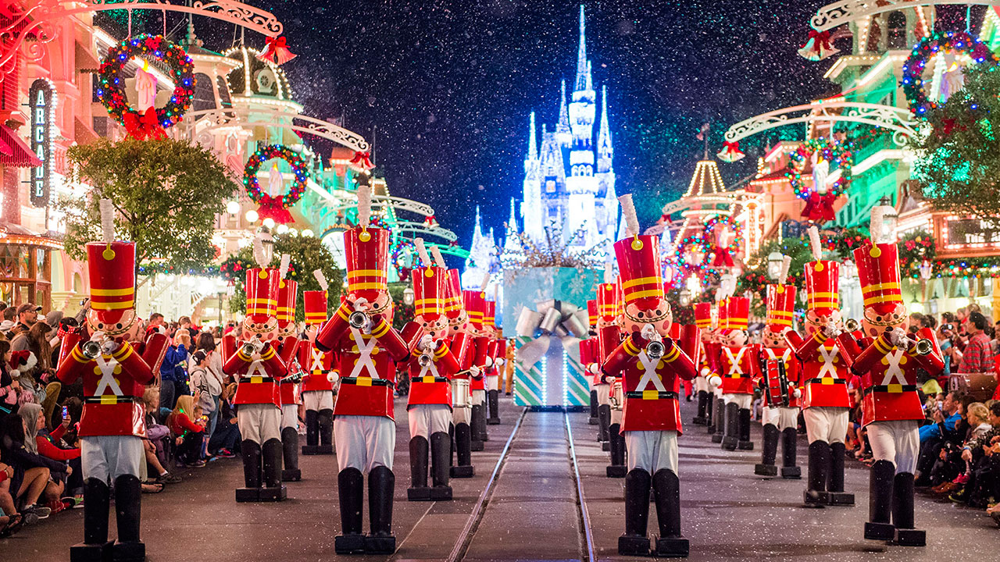
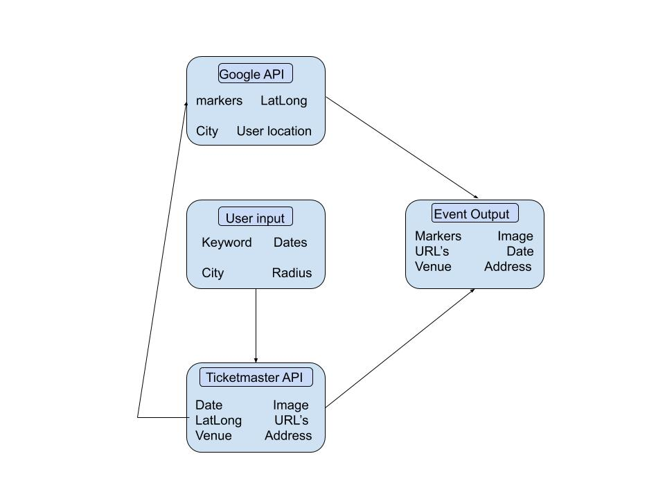

# Eventify-your-map

## Table of contents
- [General Info](#Info)
- [Technologies](#Technologies)
- [Summary](#Summary)
- [Authors](#Authors)
- [License](#License)

## Info
   
Eventify Your Map is a website that give the user the ability to search for events based on a set of criteria. The user may choose to input keywords, date ranges, cities, search radius. The usere must fill out a city. All other criteria can be left blank or filled out based on how refined the user would like their results. Once the user submits their critera the map populates all the events that match the users criteria. When the user clicks on a map marker event information and an event picture populate on the website.  

  
Screenshot of the search feature that takes in user input


Screenshot of a populated map after the search feature was submited by the user.

## Technologies
### * Bulma
Bulma is a CSS framework that is responsive, modular, modern, and free.  
Below is code for a carousel  
```html
  <section class="hero is-medium has-carousel">
        <div id="carousel-demo" class="hero-carousel">          
            <div class="item-1">
                
            </div>
            <div class="item-2">
                
            </div>
            <div class="item-3">
                

            </div>
            <div class="item-4">
                
            </div>
            <div class="item-5">
                
            </div>
            <div class="item-6">
                
            </div>
        </div>
        <div class="hero-body"></div> 
    </section>
```
For more information on Bulma click the link below.   
[Bulma Documentation](https://bulma.io/documentation/)  

### * Google Maps API
The Google Maps API used for this project was the JavaScript API version. The API has the ability to display an interactive map that can be customized in a variety of ways.  
Below is code to create a new map with the user location.  
```javascript
function initMap() {
  map = new google.maps.Map(document.getElementById("mapImage"), {
    center: tokyo,
    zoom: 11
  });

  if (navigator.geolocation) {
    navigator.geolocation.getCurrentPosition(
      function(position) {
        var pos = {
          lat: position.coords.latitude,
          lng: position.coords.longitude
        };
        map.setCenter(pos);
        userLocationCoord.lat = pos.lat;
        userLocationCoord.lng = pos.lng;
      },
      function() {
        handleLocationError(true);
      }
    );
  } else {
    handleLocationError(false);
  }
}
```
For more information on Google Maps JavaScript API click the link below.    
[Google Maps API](https://developers.google.com/maps/documentation/javascript/tutorial)  

### * Ticketmaster API
The Ticketmaster Discovery API was also used for this project. This API has the ability to return event information based on a large selection of criteria.
Below is code to create a url based on user input.  
```javascript
var startDateTime = $("#startDate").val() + "T00:00:00Z";
  if (startDateTime === "T00:00:00Z") {
    startDateTime = current + "T00:00:00Z";
  }
  var endDateTime = $("#endDate").val() + "T23:59:00Z";
  if (endDateTime === "T23:59:00Z") {
    endDateTime = future + "T23:59:00Z";
  }

  city = $("#location").val();
  keyword = $("#description").val();
  radius = $("#radius").val();

  var queryURL =
    "https://app.ticketmaster.com/discovery/v2/events?apikey=" +
    ticketmasterApiKey +
    "&keyword=" +
    keyword +
    "&radius=" +
    radius +
    "&unit=miles&locale=*&startDateTime=" +
    startDateTime +
    "&endDateTime=" +
    endDateTime +
    "&city=" +
    city;   
```
For more information on Ticketmaster Discovery API click the link below.  
[Tickmaster API](https://developer.ticketmaster.com/products-and-docs/apis/discovery-api/v2/)

### * Moment.js
Moment.js was used to get the currenr date and 1 year from the curret date. These are set as default inputs if the user does not choose a date range on their own.  
Below is the code that sets these variables
```javascript    
var current = moment().format("YYYY-MM-DD");
var future = moment()
  .add(1, "years")
  .format("YYYY-MM-DD");   
```
For more information on Ticketmaster Discovery API click the link below.  
[Moment.js](https://momentjs.com/)

### * jQuery
jQuery is a JavaScript library that makes Ajax easier to use. It is also helpful in shortening the overall length in code.  
Below is an example of an Ajax using jQuery
```javascript 
 $.ajax({
    url:
      "https://maps.googleapis.com/maps/api/geocode/json?latlng=" +
      result.lat +
      "," +
      result.lng +
      "&result_type=locality&key=" +
      googleMapsJSApikey,
    method: "GET"
  }).then(function(response) {
    city = response.results[0].address_components[0].long_name;
    $("#location").val(city);
```
For more information on jQuery click the link below.  
[jQuery](https://jquery.com/)  

## Summary
This website finds events for the curious user. First the user may enter a keyword that they would like to search for. It could be something specific like an artist, or broad like music festivals and comedy. The user can even choose to select nothing at all. The user then has the option to choose between a range of dates. If the user does not select dates it will default to a 1 year time frame. The user will then need to enter a city. This is the only input that must have something selected. Finally the user has the option to choose a search radius. It is a mile radius from the center of the city the user inputs.  
Once the user has input all the desierd information the search button can be clicked. This produces map markers of events that match the users search. When the user clicks on a map marker the informataion of that particular event is then displayed on the site. An image of the event will be displayed as well.  

the diagram below is a visual representation
 


## Authors
- Frantz Felix (https://github.com/FrantzCFelix)
- Teresa Liu (https://github.com/TeresaLiuu)
- Vaughn McPherson (https://github.com/Vaughnsmcp)
- Ryan Sousa (https://github.com/resousa)

## License

- MIT License Copyright (c) 2020 Frantz Felix, Teresa Liu, Vaughn McPherson, Ryan Sousa

Permission is hereby granted, free of charge, to any person obtaining a copy
of this software and associated documentation files (the "Software"), to deal
in the Software without restriction, including without limitation the rights
to use, copy, modify, merge, publish, distribute, sublicense, and/or sell
copies of the Software, and to permit persons to whom the Software is
furnished to do so, subject to the following conditions:

The above copyright notice and this permission notice shall be included in all
copies or substantial portions of the Software.

THE SOFTWARE IS PROVIDED "AS IS", WITHOUT WARRANTY OF ANY KIND, EXPRESS OR
IMPLIED, INCLUDING BUT NOT LIMITED TO THE WARRANTIES OF MERCHANTABILITY,
FITNESS FOR A PARTICULAR PURPOSE AND NONINFRINGEMENT. IN NO EVENT SHALL THE
AUTHORS OR COPYRIGHT HOLDERS BE LIABLE FOR ANY CLAIM, DAMAGES OR OTHER
LIABILITY, WHETHER IN AN ACTION OF CONTRACT, TORT OR OTHERWISE, ARISING FROM,
OUT OF OR IN CONNECTION WITH THE SOFTWARE OR THE USE OR OTHER DEALINGS IN THE
SOFTWARE.